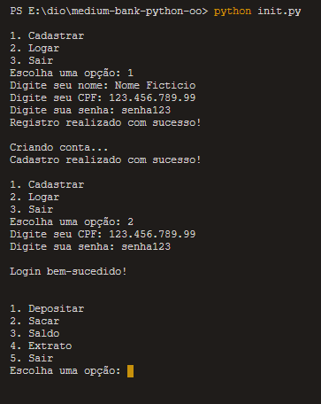
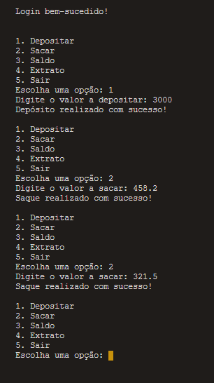
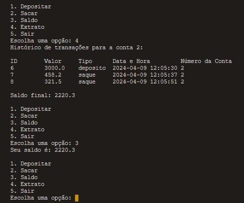
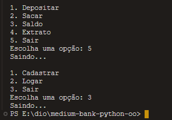

# Sistema Bancário Simples

Este é um projeto simples de um sistema bancário implementado em Python. Ele usa SQLite para gerenciar o banco de dados.

# Preview

## Bibliotecas

Este projeto usa as seguintes bibliotecas:

- sqlite3: Para interagir com o banco de dados SQLite.
- datetime: Para registrar a data e a hora das transações.

## Classes e Métodos

O projeto contém duas classes principais: `Cliente` e `Conta`.

### Classe Cliente

A classe `Cliente` representa um cliente do banco. Ela tem os seguintes métodos:

- `__init__(self, id, nome, cpf, senha)`: Construtor da classe. Inicializa um objeto Cliente com um id, nome, cpf e senha.
- `registrar(self)`: Registra o cliente no banco de dados.
- `login(cpf, senha)`: Verifica se o cpf e a senha fornecidos correspondem a um cliente no banco de dados. Se corresponderem, retorna um objeto Cliente; caso contrário, retorna None.

### Classe Conta

A classe `Conta` representa uma conta bancária. Ela tem os seguintes métodos:

- `__init__(self, cliente_id, agencia='001')`: Construtor da classe. Inicializa um objeto Conta com um id de cliente e um número de agência.
- `realizar_transacao(self, conta_numero, valor, tipo)`: Registra uma transação (depósito ou saque) no banco de dados.
- `sacar(self, conta_numero, valor, tipo)`: Tenta sacar um valor da conta. Se houver saldo suficiente, registra a transação e retorna True; caso contrário, retorna False.
- `verificar_saldo(self, conta_numero)`: Retorna o saldo atual da conta.
- `historico_transacoes(self, conta_numero)`: Imprime o histórico de transações da conta.

## Sobre

Este projeto utiliza vários conceitos de orientação a objetos, incluindo:

- **Encapsulamento**: Cada classe encapsula dados e comportamentos relacionados. Por exemplo, a classe `Cliente` encapsula os dados do cliente (id, nome, cpf, senha) e os comportamentos relacionados (registrar, login).
- **Abstração**: Cada método fornece uma interface simples para uma operação complexa. Por exemplo, o método `sacar` da classe `Conta` fornece uma maneira simples de sacar dinheiro, abstraindo os detalhes de como a transação é registrada no banco de dados.
- **Polimorfismo**: Este projeto não utiliza polimorfismo no sentido tradicional (por exemplo, através de herança e métodos substituídos), mas demonstra polimorfismo ad hoc através do uso de parâmetros. Por exemplo, o método `realizar_transacao` pode realizar diferentes tipos de transações (depósito, saque) dependendo dos argumentos passados.

## Como executar o projeto

Para executar o projeto, siga estas etapas:

1. Clone o repositório para o seu computador.
2. Navegue até o diretório do projeto no terminal.
3. Execute o script `init.py` com o comando `python init.py`.
4. Siga as instruções exibidas no terminal para interagir com o sistema bancário.

## Tecnologias usadas

Este projeto usa Python como linguagem de programação e SQLite como sistema de gerenciamento de banco de dados.
